# PENumbra

**A browser-based hidden-line-removal studio for pen plotters.**

Load a 3D model, and PENumbra computes its silhouette, contour and crease edges, works out which of
them are actually visible from your chosen angle, hatches the shaded surfaces, and lays the whole thing
out on a paper sheet as clean, plotter-ready SVG.

No accounts, no uploads, no build step — it's a single static page that does all the work in your
browser.

**Try it live: [de-nsly.github.io/PENumbra](https://de-nsly.github.io/PENumbra/)**

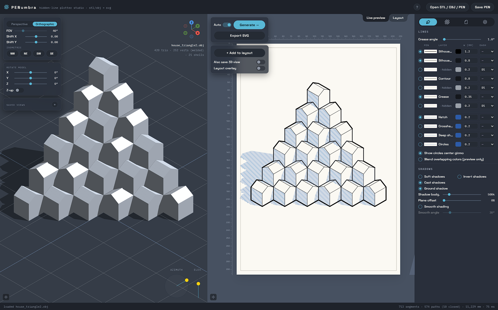
*The three panes: live 3D viewport (left), paper preview (centre), settings panel (right).*

---

## Contents

- [What it does](#what-it-does)
- [Quick start](#quick-start)
- [The interface](#the-interface)
- [How it works](#how-it-works)
- [Layers & the drawing hierarchy](#layers--the-drawing-hierarchy)
- [Lines](#lines)
- [Shading](#shading)
- [Line texture](#line-texture)
- [Page & layout](#page--layout)
- [Pens, colours & dashes](#pens-colours--dashes)
- [Exporting for the plotter](#exporting-for-the-plotter)
- [Scene files (`.pen`)](#scene-files-pen)
- [Keyboard & mouse](#keyboard--mouse)
- [Running it yourself](#running-it-yourself)
- [Limitations & tips](#limitations--tips)
- [Tech & architecture](#tech--architecture)
- [Contributing](#contributing)
- [License](#license)

---

## What it does

PENumbra turns a mesh into layered line art in the style of a technical illustration or an engraving —
the kind of drawing a pen plotter can reproduce one stroke at a time.

- **Hidden-line removal** — classifies every edge as silhouette, contour or crease, and splits each
  into a *visible* and a *hidden* layer based on ray-occlusion from the current camera.
- **Hatched shading** — parallel hatch, crosshatch and a denser "deep shadow" fill for shaded faces,
  driven by a virtual light direction, plus soft self-shadows, cast shadows and a ground shadow.
- **Concentric-circle fill** — an alternative to hatching, radiating from a point you place on the page.
- **Line texture** — trim, overshoot, jitter, wobble and gaps to take the mechanical edge off the
  hatching and give it a hand-drawn feel *(currently applied to the shading fills only, not the edge
  lines)*.
- **Per-layer control** — every edge and fill layer has its own on/off, pen colour, stroke width and
  dash style, with a drawing-priority hierarchy so a lower layer never re-inks what a higher one
  already covers.
- **Page layout** — choose a paper size, set margins, and compose several separate generations onto a
  single sheet in the Layout tab (move, scale, rotate, reorder, per-block style overrides).
- **Plotter-ready SVG export** — real millimetre page dimensions, layers grouped for multi-pen
  plotting, adjacent paths chained together to cut down on pen lifts, optional real dashed segments.
- **Live 3D preview** — orbit, pan and zoom the source mesh, with perspective/orthographic projection,
  lens shift, isometric presets and model rotation, before you commit to a generation.
- **Scene files** — save the model, camera and every setting as one `.pen` file and pick up exactly
  where you left off.

---

## Quick start

> PENumbra needs to be served over HTTP — it will not run from a `file://` page. See
> [Running it yourself](#running-it-yourself). The hosted version above needs nothing.

1. Open the app. It starts with a small demo scene already loaded.
2. **Load your own model** with **Open STL / OBJ / PEN**, or drag an `.stl` / `.obj` file onto the page.
3. In the 3D viewport, **orbit** (drag) to the angle you want. Use the projection toggle and the
   isometric presets if you need a canonical view.
4. Hit **Generate →**. The drawing appears on the paper sheet in the centre pane.
5. Adjust layers and shading in the settings panel on the right (with **Auto** on, it regenerates as
   you change things).
6. **Export SVG** when you're happy.

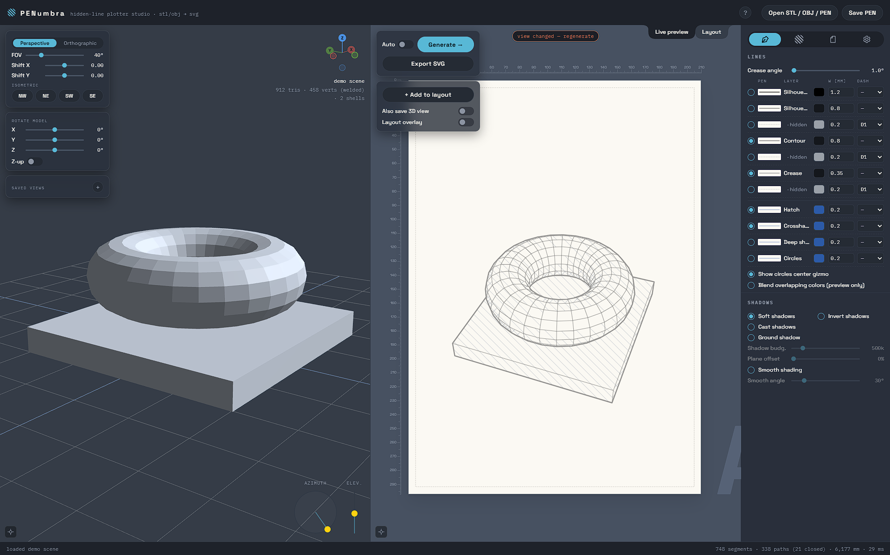

---

## The interface

The window has three regions, plus a resizable divider between the paper pane and the settings panel.

### 3D viewport (left)

The source mesh, live. Orbit with a drag, pan with Shift-drag or the arrow keys, zoom with the wheel.

- **Perspective / Orthographic** toggle, with **FOV** and **lens shift X/Y** (moves the vanishing
  point without moving the camera, like a tilt-shift lens).
- **Isometric** presets — NW / NE / SE / SW canonical views.
- **Rotate model** — X/Y/Z sliders, plus a **Z-up** toggle for CAD exports that use the Z-up
  convention.
- **Saved views** — store the current camera and jump back to it later.
- **Axis gizmo** (top-right) and **light-direction gizmo** (bottom-right); the light gizmo is
  draggable and mirrors the hatching light.
- **Recenter** (bottom-left button, or double middle-click) moves the pivot back onto the model.

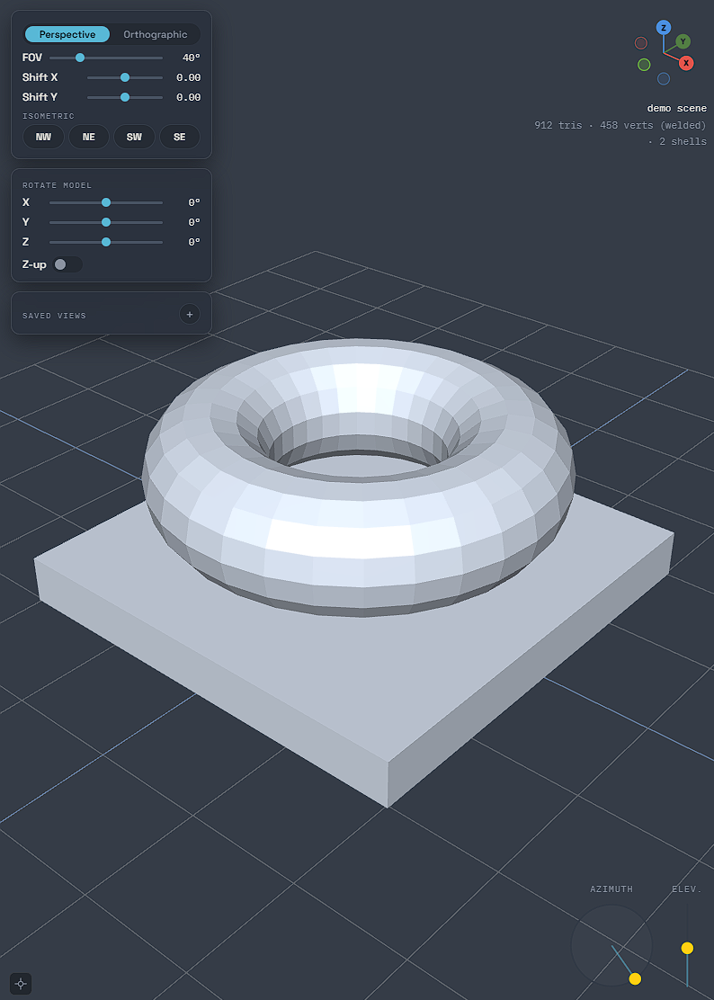

### Paper pane (centre)

The output, on a real paper sheet. Pan by dragging with the middle mouse button, zoom with the wheel,
reset with the bottom-left button or a double middle-click. A ruler runs along the top and left edges.

Two tabs:

- **Live preview** — the current generation. A "view changed — regenerate" badge appears when the
  drawing is stale relative to the camera or settings.
- **Layout** — a page you compose from *frozen snapshots* of past generations (see
  [Page & layout](#page--layout)).

The floating panel here holds **Auto** (regenerate on change), **Generate →**, **Export SVG**, and the
**Add to layout** controls.

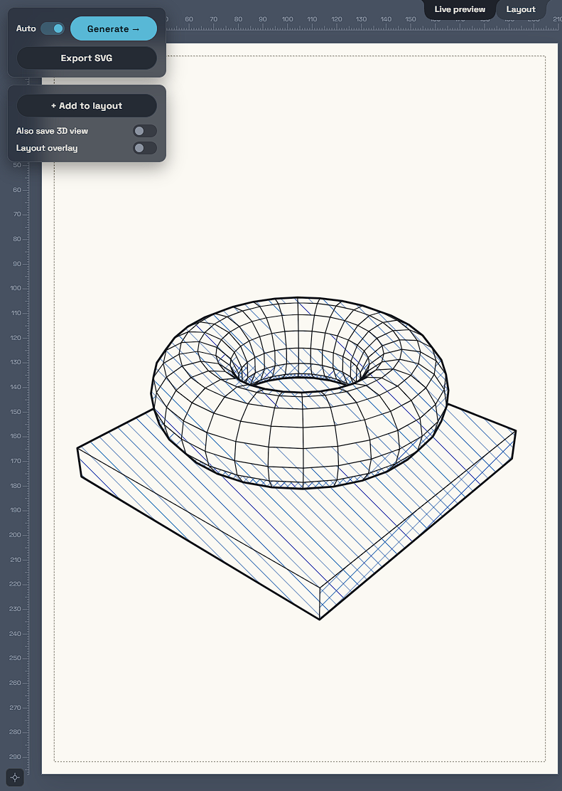

### Settings panel (right)

Four tabs, switched with the icon toggle at the top:

| Tab | Contents |
|---|---|
| **Pen** | Crease angle, the layer list (pen / colour / width / dash per layer), and all the shadow controls |
| **Texture** | Hatching parameters, the circle-fill pattern, and the line-texture effects |
| **Page** | Paper size, orientation, page colour, margins, guide grid |
| **General** | Model options (e.g. *Assume watertight*), the dash-pattern editor, dedup tuning, and debug exports |

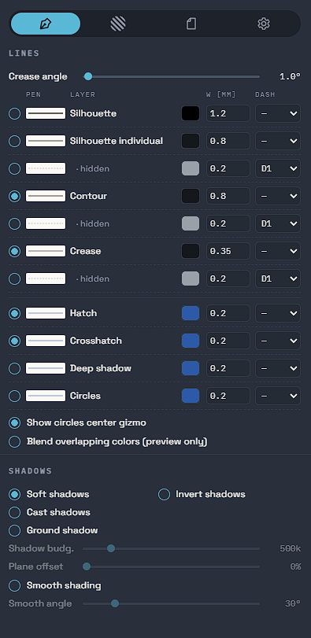

---

## How it works

Every **Generate** runs a hidden-line solve in a background Web Worker, so the interface stays
responsive while it computes:

1. **Build the mesh** — vertices, faces and edge adjacency from the triangle soup.
2. **Shadow map** — render the scene from the light's point of view for soft-shadow sampling.
3. **Visibility** — for each face and edge, cast rays toward the camera and test for occlusion.
4. **Classify edges** — every edge becomes a *silhouette*, *contour* or *crease* edge, and each of
   those is split into a *visible* and a *hidden* set.
5. **Shade** — sample the lighting across visible faces and generate hatch / crosshatch / deep-shadow
   lines or concentric circles wherever the surface is dark enough.
6. **Assemble** — the worker posts back flat per-layer path data; the main thread styles it, lays it
   on the page and builds the SVG.

The 3D viewport uses [three.js](https://threejs.org/) for display only — the solver itself has no
dependencies.

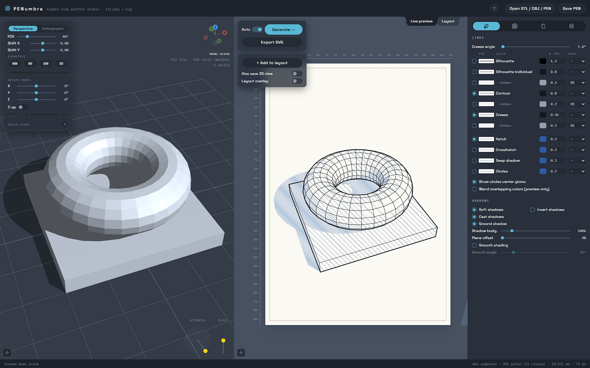

---

## Layers & the drawing hierarchy

The layer list, top to bottom, **is** the drawing-priority order:

| Layer | What it is |
|---|---|
| **Silhouette** | The outer outline where the surface turns away from the camera |
| **Silhouette individual** | Per-shell silhouettes (each connected piece outlined separately) |
| · hidden | The parts of the above that are occluded |
| **Contour** | Smooth-surface boundaries that aren't the outer silhouette |
| · hidden | occluded contour |
| **Crease** | Sharp folds between faces, past the crease-angle threshold |
| · hidden | occluded crease |
| **Hatch** | Parallel shading lines |
| **Crosshatch** | A second hatch set crossing the first, in darker areas |
| **Deep shadow** | A denser fill for the darkest areas |
| **Circles** | Concentric-circle fill (alternative to hatch/crosshatch) |

**Ink-avoidance:** a lower layer never re-strokes ink that an *enabled* higher layer already lays down.
Because of this, toggling **any** layer re-runs the whole solve — turning Contour on can change what
survives in Crease and every hatch layer below it.

Each `· hidden` sub-layer is the occluded portion of the layer above it, and is drawn dashed by
default.

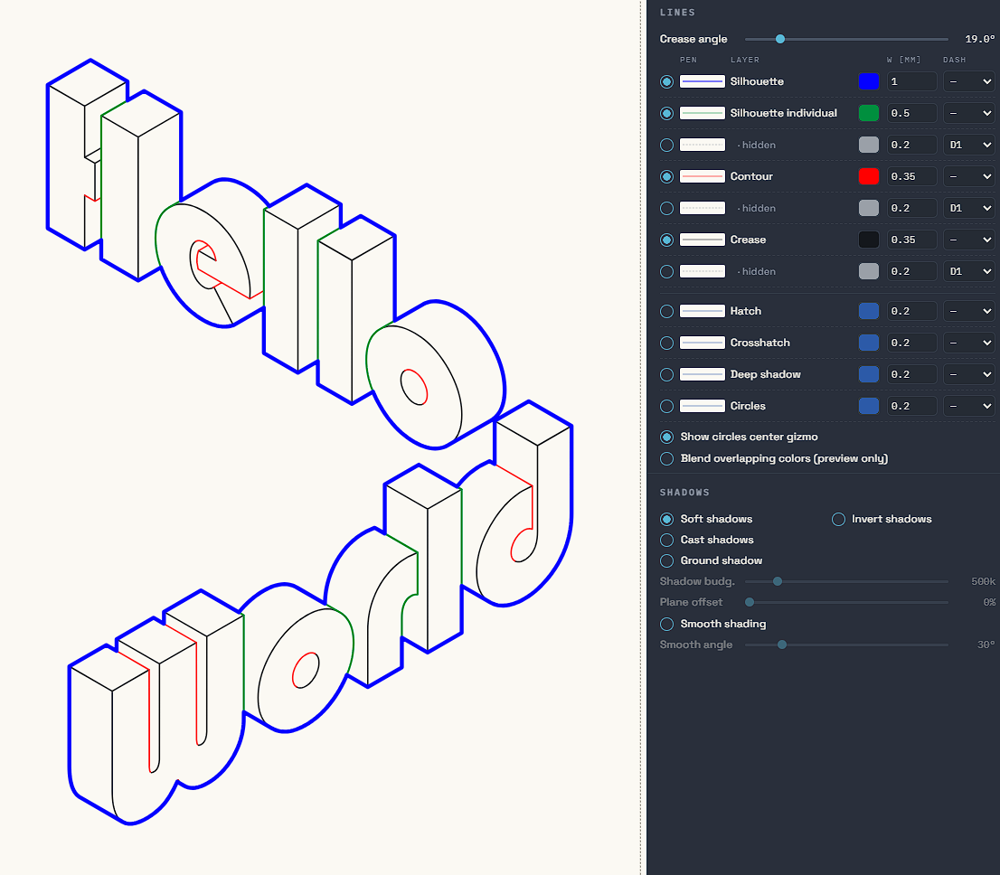

---

## Lines

**Crease angle** (Pen tab) sets how sharp a fold between two faces has to be before it counts as a
crease edge. Low values keep only genuinely hard edges; high values turn gentle curvature into creases
too.

**Dedup** (General tab) cleans up the raw solver output, where the same physical edge can be traced by
two nearly-coincident segments, or a single edge can be broken by an occlusion gap:

- **Match tolerance** — how close two segments' offset must be to be merged into one stroke.
- **Bridge gap** — how large a gap along one line can be before the two halves stop being joined.

Both are multipliers on the solver's own zoom-independent tolerance; `1.00×` is the default.

---

## Shading

Shading is driven by a virtual light. Set its direction with **Light azimuth / elevation** (Texture
tab) or by dragging the light gizmo in the 3D viewport.

**Fill thresholds** decide which fill a face gets, based on how dark it is (0 = black, 1 = fully lit):

| Control | Meaning |
|---|---|
| **Hatch below** | faces darker than this get hatched |
| **Cross below** | …and darker than this also get crosshatched |
| **Deep below** | …and darker than this get the deep-shadow fill |
| **Circles below** | threshold for the concentric-circle fill |

Other hatching controls: **Hatch angle**, **min / max spacing** (spacing scales with darkness between
these), and **Hatch cap** (a safety limit on total hatch segments per generate).

**Shadow options** (Pen tab):

- **Soft shadows** — the object shading itself, sampled through the shadow map.
- **Cast shadows** — shadows the object throws onto its own other parts.
- **Ground shadow** — an analytic shadow cast onto an implied ground plane; **Plane offset** slides
  that plane.
- **Invert shadows** — draw the fills in the *lit* areas instead of the shadowed ones.
- **Smooth shading** — blends face normals for smoother shade gradients (and a smoother 3D preview);
  **Smooth angle** is the dihedral cutoff past which an edge stays hard.

The **Circles** fill radiates from a centre point you position with **Center X / Y** (Texture tab) or
by dragging the on-canvas gizmo.

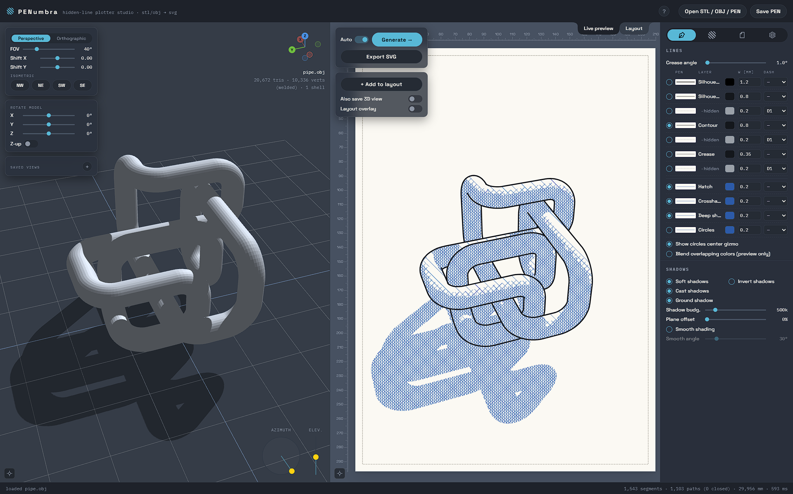
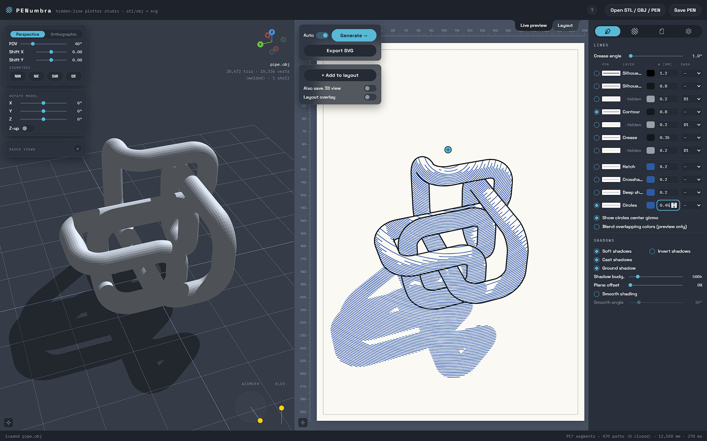

---

## Line texture

The **Texture** tab has a set of effects that rough up the mechanical regularity of the shading fills
and give them a looser, hand-drawn character:

| Effect | What it does |
|---|---|
| **Trim / extend** | shorten or lengthen every stroke by a fixed amount |
| **Overshoot / undershoot** | randomise each stroke's start/end past or short of its true endpoint |
| **Spacing jitter** | vary the gap between adjacent hatch lines |
| **Angle jitter** | vary each stroke's angle slightly |
| **Wobble** | ripple each stroke along a noise field (optionally the *same* field for every layer) |
| **Regular wobble** | a clean sine-wave ripple instead of noise |
| **Gaps** | randomly break strokes into segments, with pen-up gaps |

> **Note:** these effects currently apply to the **shading fills** (Hatch / Crosshatch / Deep shadow /
> Circles) only — not to the silhouette, contour or crease edge lines.

**Individual texture settings** (Texture tab) switches from one shared set of values to a separate set
per fill layer (H1 / H2 / H3 / Circles).

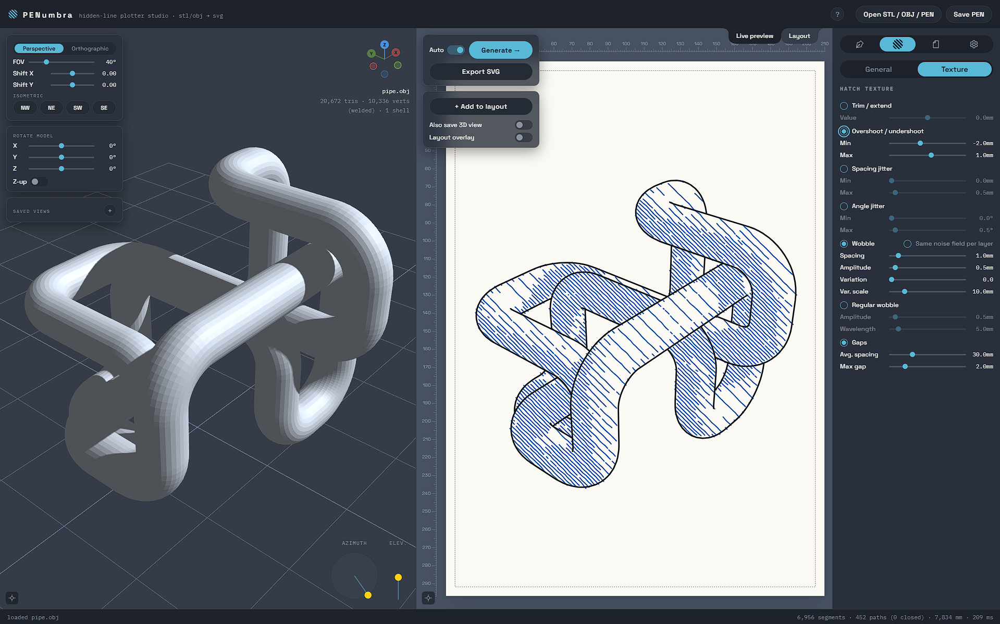

---

## Page & layout

### Page tab

- **Paper** — A0 through A6.
- **Orientation** — portrait / landscape.
- **Page colour** — the sheet background (preview only; not exported as a fill).
- **Margins** — a single value, or independent top / bottom / left / right.
- **Guide grid** — evenly-spaced reference lines across the page that also act as snap targets in the
  Layout tab.

### Layout tab

The Layout tab is a page you build up from **frozen snapshots** of past generations, so you can put
several views — or several models — on one sheet.

- **Add to layout** (from the Live preview float) drops the current generation onto the layout page as
  a *block*.
- **Move / scale / rotate** blocks directly on the page; hold Shift while dragging to constrain to one
  axis, or while rotating to snap to 5°.
- Blocks **snap** to the margins, page centre and guide grid.
- **Select** several blocks at once, Windows Explorer style: Ctrl/⌘+click adds or removes one, Shift+click
  in the Layers list selects everything between the last-clicked block and this one, Ctrl/⌘+A selects all,
  and dragging a box on empty page space rubber-band-selects (hold Shift or Ctrl/⌘ to add to the selection).
  Hidden and locked blocks can be selected from the list like any other — they just stay inert on the
  page (no outline, no handles, never moved by a drag or the arrow keys), so a batch of them can still be
  un-hidden, unlocked or deleted in one action.
- **Duplicate**, **reorder** (drag the handle in the Layers list) and **delete** blocks. A row's
  visibility / lock / delete button acts on the whole selection when that row is part of it, and on
  that row alone otherwise, and puts every block in the same state as the one you clicked;
  **Duplicate** copies every selected block at once. <kbd>Delete</kbd>/<kbd>Backspace</kbd> on the canvas
  only removes blocks that aren't locked or hidden — use the list's delete button for those.
- Each block has its own **layer visibility** and optional per-layer **style overrides** (right-click a
  block).
- **Rotate layers with page** rotates every block when you flip portrait/landscape, as if you'd
  physically turned the sheet.

**Layout overlay** (Live preview float) shows the layout page as a static underlay/overlay on the live
preview — useful for lining up the next view with what's already placed. Toggle it **behind** or **in
front**, and set its opacity.

> The Layout tab's "layers" (blocks) are a different concept from the edge/fill **layers** in the Pen
> tab — same word, different thing.

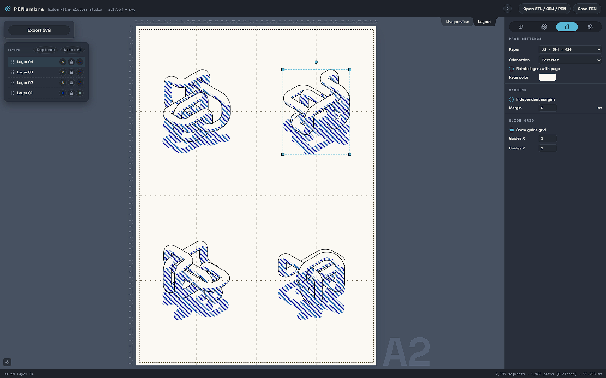

---

## Pens, colours & dashes

Each row in the layer list (Pen tab) carries a **pen swatch**, **colour**, **stroke width in mm** and
a **dash style**.

The **dash editor** (General tab) defines up to 9 named dash patterns. Dash and gap lengths are true
millimetre values, independent of pen width — a 10 mm dash is 10 mm on the plotted page whether the pen
is 0.15 mm or 1.2 mm. Each pattern has a live preview.

- **Split dashes** (Pen tab) — on export, turn dashed strokes into real separate path segments rather
  than relying on SVG `stroke-dasharray`, which many plotter toolchains ignore.
- **Blend overlapping colours** — a preview-only multiply blend so you can see where inks would
  overlap; it does not change the export.

---

## Exporting for the plotter

**Export SVG** produces a file with:

- The **real page size** in millimetres, so it drops straight into a plotter workflow at 1:1.
- One **group per layer**, in draw order, so you can assign a pen per group for multi-pen plotting.
- **Chained paths** — adjacent open segments are joined into longer polylines to reduce pen lifts and
  travel.
- Optional **real dashed segments** (see *Split dashes* above).

Hidden layers are exported too, if you leave them enabled — handy if you want them plotted in a lighter
pen, or want to delete them downstream.

The output is plain SVG and works with the usual plotter tools (AxiDraw / `vpype` / Inkscape-based
workflows and similar).

---

## Scene files (`.pen`)

**Save PEN** writes one file containing:

- the model geometry (embedded), and whether it was imported Z-up
- the camera state
- every setting and every layer's style
- your saved views and the entire Layout page

Open a `.pen` the same way as a mesh — the **Open STL / OBJ / PEN** button, or drag-and-drop. Each file
also records the app version and a save timestamp.

---

## Keyboard & mouse

Click the **?** button in the top-right of the app for the full, always-current list of keyboard and
mouse shortcuts (panning, orbiting, the Layout tab, in-place value editing, and more).

---

## Running it yourself

PENumbra is a static site, but the hidden-line solver runs as a **module Web Worker** loaded from a
separate `.js` file — and browsers refuse to load module workers from a `file://` page. So you need to
serve the folder over HTTP:

```sh
git clone https://github.com/de-nsly/PENumbra
cd PENumbra
python3 -m http.server 8000
# then open http://localhost:8000/
```

Any static file server works — `python3 -m http.server`, `npx serve`, the VS Code Live Server
extension, etc. There is no build step and nothing to install.

The first load fetches the three.js library from a CDN and the fonts from Google Fonts, so it needs
network access once; after that the browser cache covers it.

---

## Limitations & tips

- **Serve over HTTP** — see above. The hosted version sidesteps this.
- **Mesh size** — the solve is O(triangles × visibility samples). A few tens of thousands of triangles
  is comfortable; very dense scans will be slow. Decimate heavy meshes first.
- **Non-watertight meshes** — the **Assume watertight** option (General tab) lets the solver cull
  back-facing occluders, which is faster and cleaner; turn it off for open shells or single surfaces.
- **Line texture is shading-only** for now — the edge lines are always drawn crisp.
- **Page colour is preview-only** — it is not written into the exported SVG as a background rectangle.

---

## Tech & architecture

- **Vanilla JavaScript**, no framework, no bundler, no `package.json`. Plain global-scope scripts
  loaded in order at the bottom of `index.html`.
- **One dependency:** three.js r128 (CDN), used only for the 3D viewport.
- **The solver** (`js/worker/*.js`) runs in a module Web Worker and is dependency-free. It communicates
  with the main thread by `postMessage` only.

`CLAUDE.md` in the repo root has the full architecture write-up — the worker message protocol, the HLR
pipeline stages, the file map and the load-order rules.

---

## Contributing

There's no build and no test suite. Edit a file, reload the page (served over HTTP), and exercise the
change — load a model, toggle layers, Generate, export. Each source file has a header comment
describing its responsibilities and its cross-file dependencies; read that before reordering the
`<script>` tags.

---

## License

GPL-3.0 — see [LICENSE](LICENSE).
